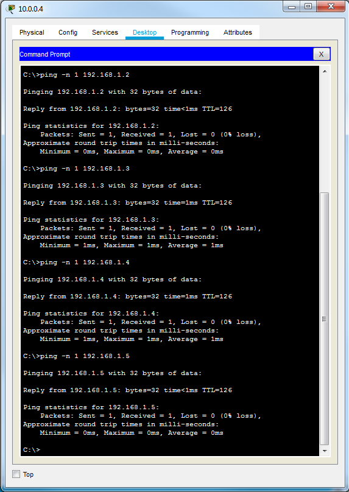
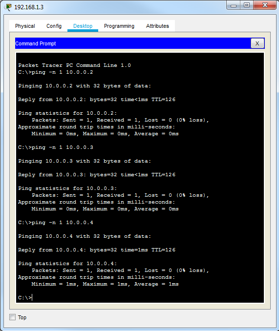
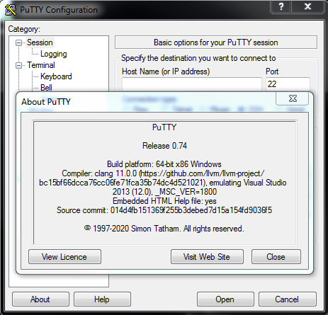
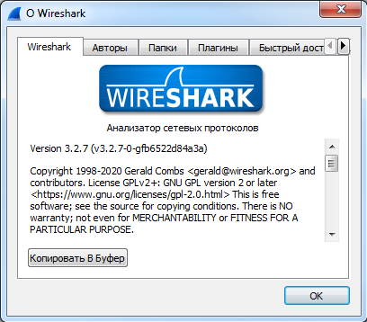
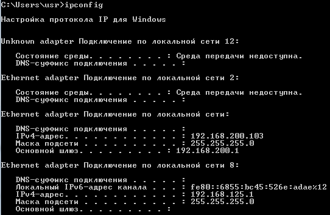
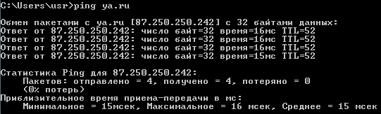
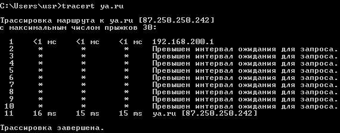
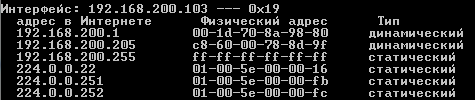
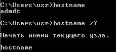

#### 1
*Скачать и установить cisco packet tracer 7.0.*

#### 2
*Диагностика физического уровня. Скачать файл packet tracer, в котором собрана сеть с несколькими хостами (в центре хаб, а также пара компьютер – компьютер), в каждом из которых проблема с линком. Задача: поднять все линки и проверить связь командой ping.*

Поправил шлюзы, скорость на интерфейсе, соединил устройства.

[Файл задания](Task1.pkt)

Скриншоты проверки:

#### 3

*Скачать и установить putty: http://www.putty.org/ (понадобится в дальшнейшем).*

#### 4
*Скачать и установить wireshark: https://www.wireshark.org/download.html (будет предложено установить драйвер pcap – это необходимо сделать, иначе wireshark не получит доступ к канальному уровню ОС).*

#### 5
*Попробовать команды tracert/ping/ipconfig на домашнем компьютере.*

ipconfig:

ping

tracert:

#### 6

*Попробовать команды (по желанию) hostname / arp и разобраться с выводом.*

Часть вывода команды **arp -a**:

Показывает кэш соответствия ip <-> mac.

hostname:

#### 8

*Определить и записать физическую топологию сетей (см. рисунок в методичке)*
