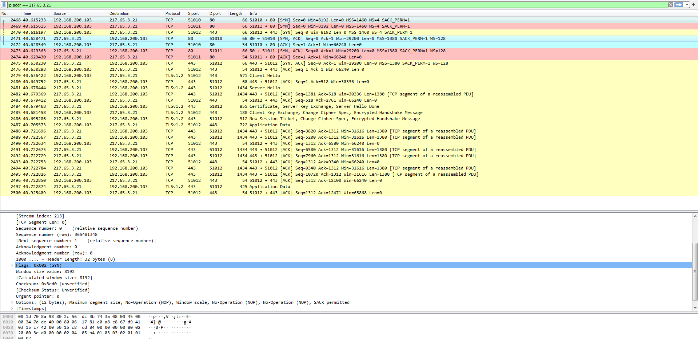

#### 1
*Работа в Wireshark. Запустить Wireshark, выбрать любой веб-сайт, определить IP-адрес сервера, отфильтровать в Wireshark трафик по этому IP-адресу. Набрать адрес сервера в строке браузера. Сколько TCP-соединений было открыто и почему. В работе можно использовать источники из списка дополнительных материалов.*

Выясняем ip-адрес ресурса opennet.ru для фильтрации по нему в Wireshark.

Заходим в браузере по адресу http://opennet.ru. Смотрим отфильтрованные пакеты.

На скрине видно, что браузер устанавливал 3 соединения. Поскольку в HTTP/1.1 по умолчанию используются постоянные соединения, а RFC больше не ограничивает их количество, то браузер сам решает, сколько ему использовать по ситуации. В данном случае было сразу открыто два соединения на 80 порт (выделены голубым и красным) и одно на 443 (желтый цвет). Поскольку сайт оказался доступен по https, в дальнейшем соединения по 80 порту не использовались, а страница была передана в одном постоянном соединении.

#### 2
*Настроить перегруженный NAT в предложенной скрине схемы из Cisco Packet Tracer. Посмотреть таблицу трансляции NAT на маршрутизаторе.*

В этой схеме в динамической маршрутизации смысла не увидел, на R0 достаточно прописать маршрут по умолчанию.

[Файл задания](Task5.pkt)

Таблица трансляций на роутере:

В симуляции видно, что адрес отправителя подменяется на адрес роутера:

