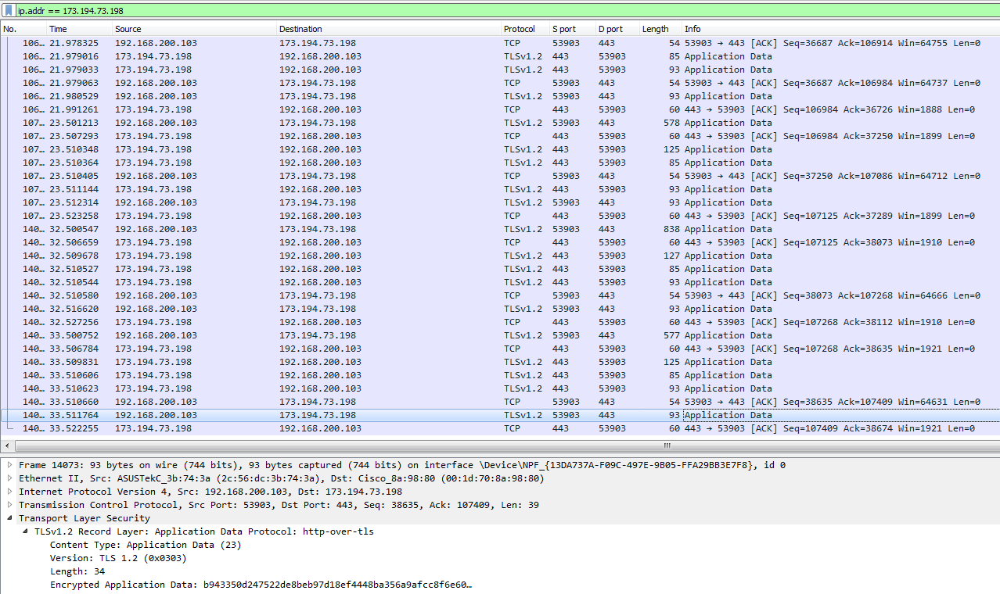

#### 1
*1) Запустить Wireshark, выбрать любой веб-сайт по HTTP, где требуется вход или регистрация по паролю, например зайти на http://samlib.ru (или другой нешифрованный Http), ввести тут http://samlib.ru/cgi-bin/login любой пароль. Какую информацию можно узнать с помощью Wireshark?
2) С помощью Wireshark идущий по протоколу HTTP и HTTPS. В чем разница? Попробовать отследить трафик в Wireshark, подключаясь к сервисам Google (например, youtube.com) с помощью браузера Google Chrome. Какой протокол используется для доступа к веб-сервисам?
3) С помощью Wireshark отследить трафик при работе с обычным ftp (найти любой ftp-ресурс и подключиться к нему, через браузер). Можно ли через ftp передавать данные на сервер, как предлагают некоторые хостеры?*

1. Выясняем ip-адрес для сайта *samlib.ru*:

Заходим на сайт и смотрим дамп:

Как видим, в случае HTTP можно получить всю передаваемую информацию, в т.ч. логины и пароли (на скриншоте 12345 - логин, 67890 - пароль).

2. Насколько я понимаю, требуется сравнить трафик по протоколу http и https.

На этом скриншоте дамп запроса "test" на www.google.com:

На нем видно, что по 443 TCP порту с помощью TLSv1.3 пересылаются зашифрованные данные с помощью http-over-tls.

Аналогично для youtube, только тут используется TLSv1.2:

Несмотря на включенную поддержку QUIC в браузере, UDP трафика к серверам youtube я не увидел.

----

В случае http, например, kremlin.ru, мы можем видеть все запросы и их содержимое, а также версию используемого протокола: HTTP/1.1.

3. Установил FileZilla на компьютер, подключился по 127.0.0.1. Скопировал файл по ftp, т.е. данные передавать можно.

#### 2
*1) Просмотреть А-записи для доменов mail.ru, geekbrains.ru, vk.com. Сколько IP адресов серверов у этих ресурсов? Какой из них отвечает при выполнении команды ping на mail.ru, geekbrains.ru, vk.com соответственно?
2) Просмотреть NS-записи для доменов google.com и youtube.com. Какой можно сделать вывод по результатам вывода этих двух команд?*

1.
- mail.ru - 4 ipv4 адреса.

Ответил второй из списка.

- geekbrains.ru - 1 ipv4 адрес.

Он же отвечает на ping.

- vk.com - 6 ipv4 адресов.

В данном случае ответил последний из списка.

2. NS-записи для google.com:

Для youtube.com:

Используются одни и те же NS-серверы. В разное время на пинг (или любые другие запросы) может отвечать любой из ip-адресов, относящихся к А-записи. Обычно DNS-серверы используют алгоритм round-robin для распределения нагрузки (т.е., выдают адреса по кругу). Помимо этого, приложения могут самостоятельно переключаться на другие ip в случае необходимости.
