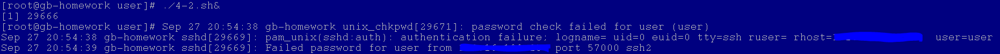
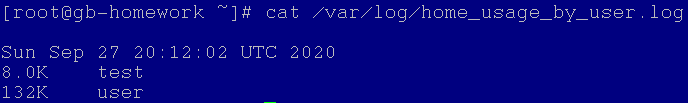

#### 1
*Написать скрипт, который удаляет из текстового файла пустые строки и заменяет маленькие символы на большие (воспользуйтесь **tr** или **sed**).*

[4-1.sh](4-1.sh)

#### 2
*Изменить скрипт мониторинга лога, используя утилиту tailf, чтобы он выводил сообщения при попытке неудачной аутентификации пользователя /var/log/auth.log, отслеживая сообщения примерно такого вида:*

    May 16 19:45:52 vlamp login[102782]: FAILED LOGIN (1) on '/dev/tty3' FOR 'user', Authentication failure

*Проверить скрипт, выполнив ошибочную регистрацию с виртуального терминала.*

В CentOS файл лога **/var/log/secure**.

И регистрация FAILED LOGIN выглядит вот так:

    Sep 27 20:29:35 gb-homework unix_chkpwd[29531]: password check failed for user (user)
    Sep 27 20:29:36 gb-homework sshd[29516]: Failed password for user from IP_ADDRESS port 59069 ssh2

Соответственно, можно проверять по, например, вот такой регулярке [Ff]ail.

[4-2.sh](4-2.sh)

#### 3
*Создать скрипт, который создаст директории для нескольких годов (2010 — 2017), в них — поддиректории для месяцев (от 01 до 12), и в каждый из них запишет несколько файлов с произвольными записями (например, 001.txt, содержащий текст«Файл 001», 002.txt с текстом Файл 002) и т. д.*

[4-3.sh](4-3.sh)

#### 4
*Создать файл crontab, который ежедневно регистрирует занятое каждым пользователем дисковое пространство в его домашней директории.*

Скрипт собирает информацию вида "Занято пользователь" и кладет в */var/log/home_usage_by_user.log*.

[4-4.sh](4-4.sh)

Содержимое файла */etc/crontab*:

    # Example of job definition:
    # .---------------- minute (0 - 59)
    # |  .------------- hour (0 - 23)
    # |  |  .---------- day of month (1 - 31)
    # |  |  |  .------- month (1 - 12) OR jan,feb,mar,apr ...
    # |  |  |  |  .---- day of week (0 - 6) (Sunday=0 or 7) OR sun,mon,tue,wed,thu,fri,sat
    # |  |  |  |  |
    # *  *  *  *  * user-name  command to be executed

     12 23  *  *  * root    bash /root/4-4.sh

#### 5
*Создать скрипт ownersort.sh, который в заданной папке копирует файлы в директории, названные по имени владельца каждого файла. Учтите, что файл должен принадлежать соответствующему владельцу.*

[ownersort.sh](ownersort.sh)
