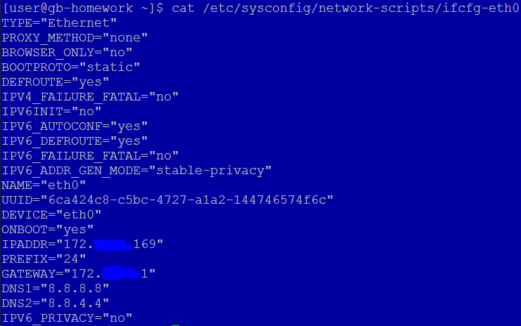
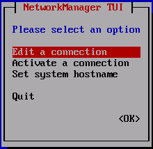
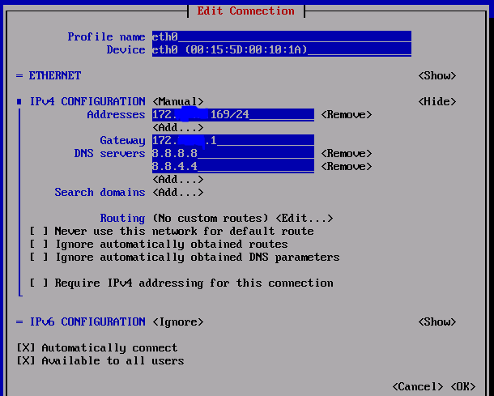
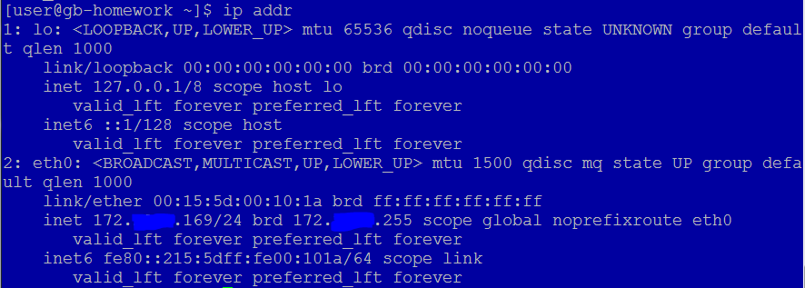
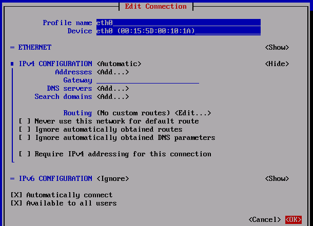
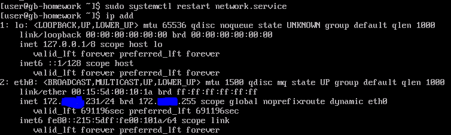
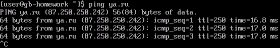
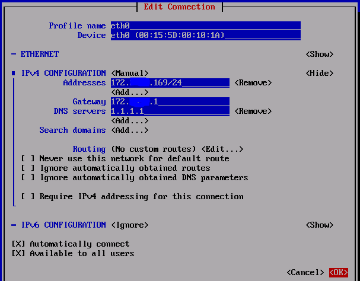
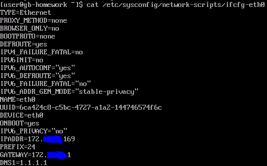
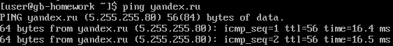

#### 1
*Произвести ручную настройку сети в Ubuntu, на каждом шаге сделать скриншоты.*

В моем случае система - CentOS, поэтому настройка будет другой.
Варианты:
1. Правка конфигурационного файла интерфейса в текстовом редакторе. Задано вручную.

2. Утилита **nmtui**:

Проверяем:

#### 2
*Переключить настройку сети на автоматическую через DHCP, проверить получение адреса.*

Переключаем на DHCP:

При правке руками конфигурационного файла интерфейса необходимо удалить следующие строки:
IPADDR
PREFIX
GATEWAY
DNS1
DNS2

И изменить BOOTPROTO со static на dhcp.

При любом варианте после внесения изменений нужно либо перезагрузить службу **network**, либо сделать **ifdown eth0 && ifup eth0**.

#### 3
*Изменить адрес DNS на 1.1.1.1 и проверить доступность интернета, например, открыв любой браузер на адрес https://geekbrains.ru.*

Проверяем работу Интернета:

Меняем DNS:

Опять проверяем:

Ничего не изменилось. Причина в том, что 1.1.1.1 - это публичный DNS. Если изменить на адрес, который не является таковым, то работать будет доступ только через ip-адреса.

#### 4
*Настроить правила iptables, чтобы из внешней сети можно было обратиться только к портам 80 и 443. Запросы на порт 8080 перенаправлять на порт 80.*

#### 5
*Дополнительно к предыдущему заданию настроить доступ по ssh только из указанной сети.*
