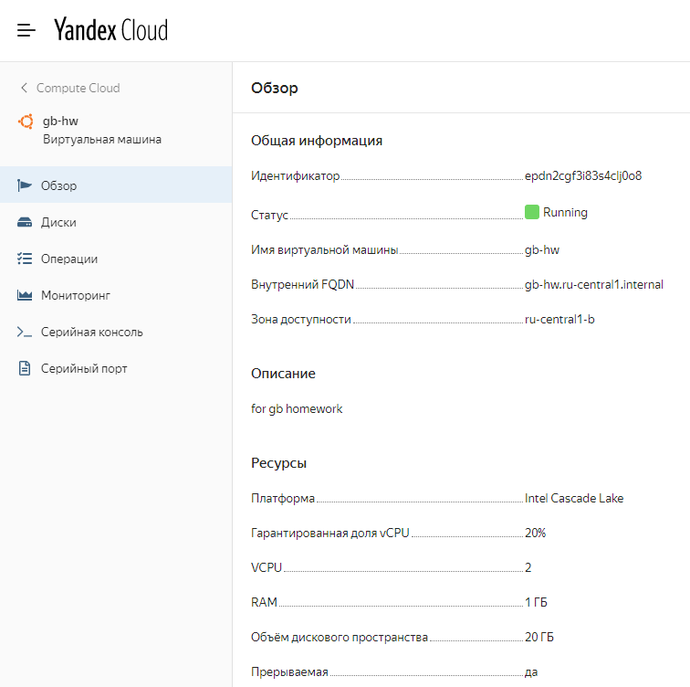
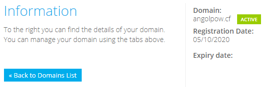
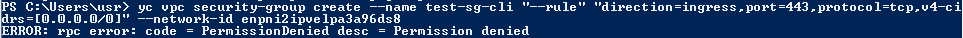
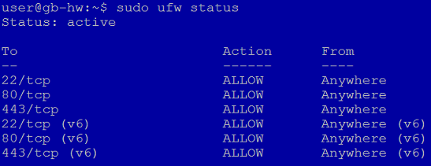
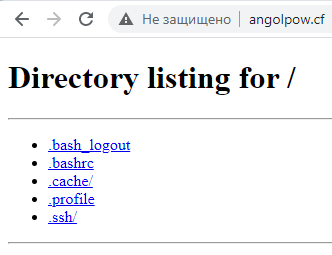
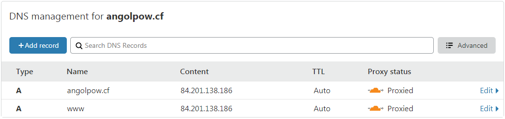

#### 1
*Настроить виртуальный сервер в облаке (GCP, AWS, VDS и др.) с публичным IP-адресом.*

Поднял ВМ на Яндексе.

#### 2
*Зарегистрировать свой домен через freenom.com.*

Зарегистрировал домен *angolpow.cf*:

#### 3
*Настроить фаервол, чтобы был доступ только к сервисам http и ssh.*

У Яндекса, как я понял, настройка схожа с AWS - создаются Security groups и привязываются к сетям. Несмотря на то, что в описании тестового периода эту группы указаны (10 штук), создать мне их не дали. В GUI (по документации) этого пункта вообще не было, через cli я получил отказ:

Поэтому воспользовался фаерволом на самой ВМ:

Проверка SimpleHTTPServer'ом:

#### 4
*Передать управление NS-записями на cloudflare.com*

Управление DNS сразу было передано cloudflare:

