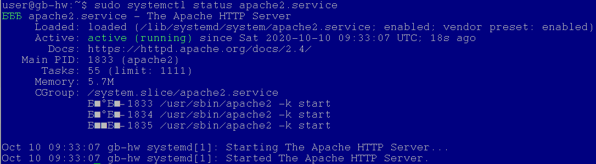
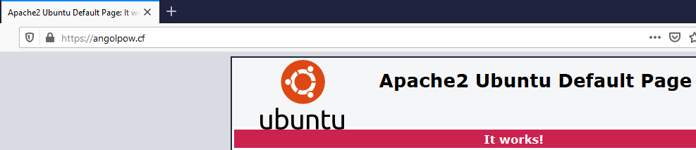
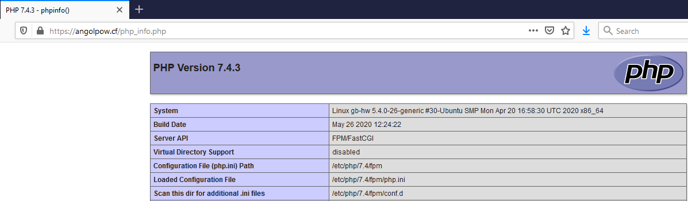
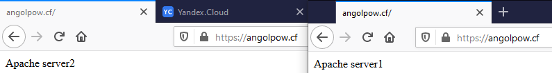
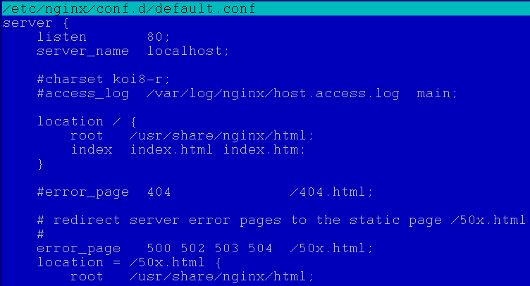
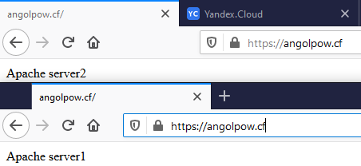

#### 1
*Установить Apache2. Прислать скриншоты работающего сервера*

Установил Apache2 (ВМ на Яндексе).

#### 2
*Установить Nginx и настроить его на работу с php-fpm.*

Установил php-fpm и настроил работу через unix-сокет.

#### 3
*Настроить Nginx в качестве балансировщика. Используя mod_upstream, раскидывать весь входящий трафик по трем Apache2-серверам, находящимся в локальной сети.*

Для экономии использовал только 2 бэкенд сервера:

#### 4
*Установить и настроить nginx из репозитория nginx.org*

Переустановил nginx из репозитория nginx.org:

Опять настроил в качестве балансировщика:

