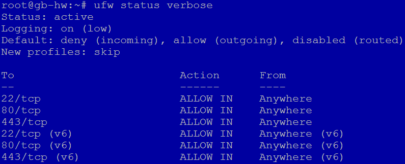
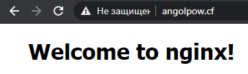
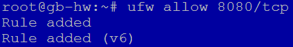
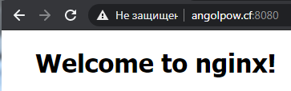
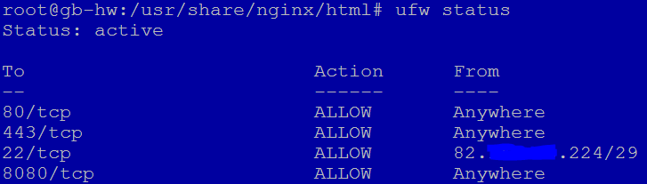
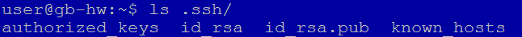
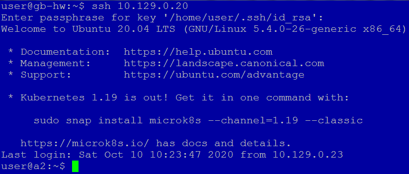

#### 1
*Настроить сетевой фильтр, чтобы из внешней сети можно было обратиться только к сервисам http и ssh (80 и 443).*

В принципе, это было сделано еще в 6 ДЗ через ufw:

#### 2
*Запросы, идущие на порт 8080, перенаправлять на порт 80*

Здесь уже сложнее, ufw умеет роутинг, но не редирект. Добавляем в самое начало файла **/etc/ufw/before.rules**:

    *nat
    :PREROUTING ACCEPT [0:0]
    -A PREROUTING -p tcp --dport 8080 -j REDIRECT --to-port 80
    COMMIT

Открываем порт:

Проверяем:

#### 3
*Настроить доступ по ssh только для вашего IP-адреса (или из всей сети вашего провайдера).*

Настроил доступ только для рабочей подсети:

#### 4
*Создать нового пользователя, сгенерировать для него новые сертификаты. Настроить доступ на сервер вновь созданного пользователя с использованием сертификатов. Подключиться с помощью putty или ssh без ввода пароля (используя только сертификат).*

Запустил еще одну ВМ на Яндексе. На первой сгенерировал ключи:

Добавил на новую машину открытый ключ. Подключился с первой на вторую ВМ по ssh без пароля:

#### 5
*Ваши коллеги, студенты, настраивали VDS-сервер для использования на командном проекте...*
